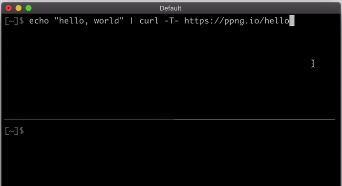
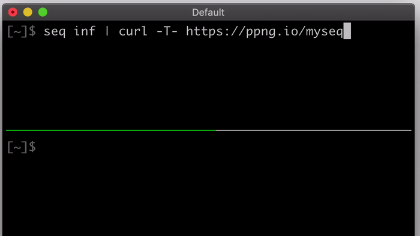
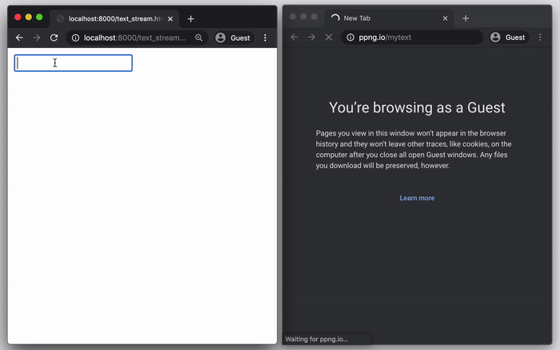
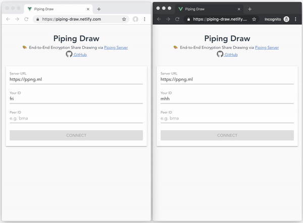
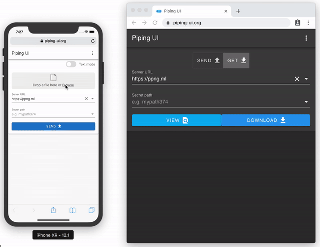
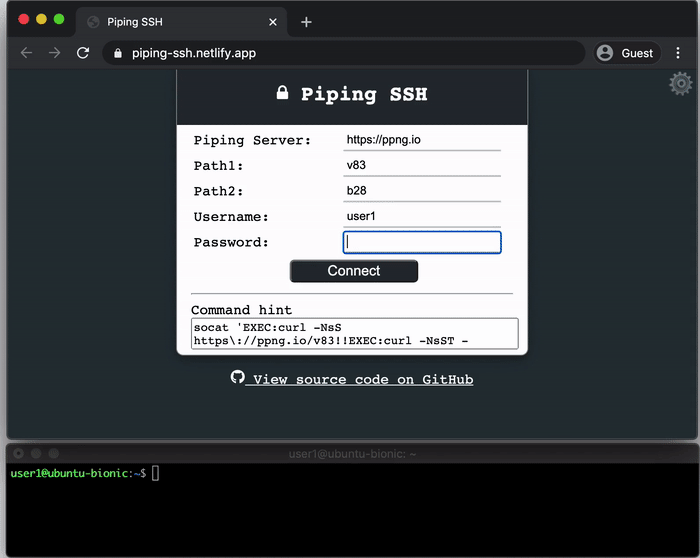
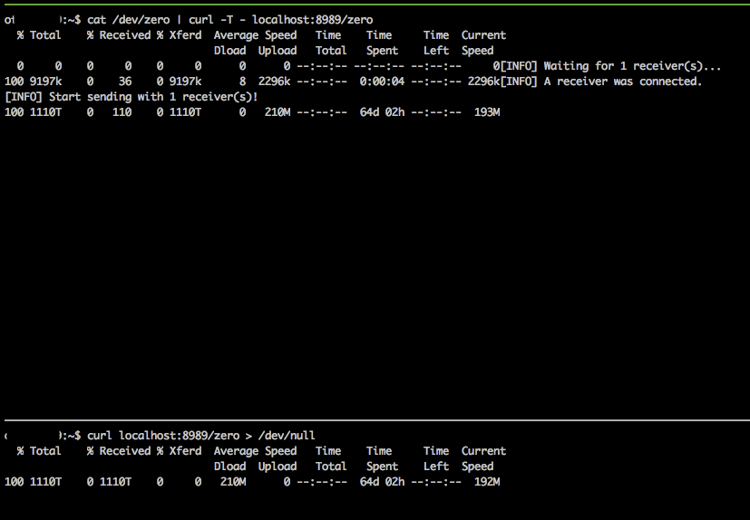

# Piping Server
[](https://www.npmjs.com/package/piping-server) [](https://www.codefactor.io/repository/github/nwtgck/piping-server) [](https://circleci.com/gh/nwtgck/piping-server) [](https://ci.appveyor.com/project/nwtgck/piping-server)  [](https://github.com/nwtgck/piping-server/actions) [](https://hub.docker.com/r/nwtgck/piping-server/)
 [](https://microbadger.com/images/nwtgck/piping-server "Get your own image badge on microbadger.com") [](https://dependabot.com)

Infinitely transfer between every device over HTTP/HTTPS  



## Transfer

Piping Server is simple. You can transfer as follows.

```bash
# Send
echo 'hello, world' | curl -T - https://ppng.io/hello
```

```bash
# Get
curl https://ppng.io/hello > hello.txt
```

Piping Server transfers data to `POST /hello` or `PUT /hello` into `GET /hello`. The path `/hello` can be anything such as `/mypath` or `/mypath/123/`. A sender and receivers who specify the same path can transfer. Both the sender and the recipient can start the transfer first. The first one waits for the other. 

You can also use Web UI like <https://ppng.io> on your browser. A more modern UI is found in <https://piping-ui.org>, which supports E2E encryption.


### Stream
The most important thing is that the data are streamed. This means that you can **transfer any data infinitely**. The demo below transfers an infinite text stream with `seq inf`.



## Ideas
Piping Server is designed based on the ideas as follows.

- **Infinite transfer**: You can transfer any kind of data infinitely on a stream. Streams are very efficient in terms of both time and space.
- **Zero installation**: All you need is to have either a Web browser or `curl`, which are widely pre-installed. You do not need to install any extra software.
- **Simpleness**: Making simple makes it more secure.
- **Storageless**: The server makes transfer more secure since the server never stores your data.
- **Purity**: The server streams over pure HTTP, which makes integration easier with other softwares.
- **Engineer friendly**: Also designed for Unix/Linux users, who use pipes, not only for Web browser users.


## Applications

Any data such as text streams, video streams and protocols can be streamed over Piping Server. Here are applications that fully use the power of pure HTTP.  
See: "[The Power of Pure HTTP – screen share, real-time messaging, SSH and VNC](https://dev.to/nwtgck/the-power-of-pure-http-screen-share-real-time-messaging-ssh-and-vnc-5ghc)"


<table>
  <tr>
    <td></td>
    <td></td>
    <td></td>
  </tr>
  <tr>
    <td><a href="https://github.com/nwtgck/piping-server-streaming-upload-htmls/blob/a107dd1fb1bbee9991a9278b10d9eaf88b52c395/text_stream.html">Text stream chat</a></td>
    <td><a href="https://github.com/nwtgck/piping-server-streaming-upload-htmls/blob/a107dd1fb1bbee9991a9278b10d9eaf88b52c395/screen_share.html">Screen share</a></td>
    <td><a href="https://github.com/nwtgck/piping-draw-web">Drawing share</a></td>
  </tr>
</table>
<table>
  <tr>
    <td></td>
    <td></td>
    <td></td>
  </tr>
  <tr>
    <td><a href="https://github.com/nwtgck/piping-ui-web">E2E encryption file transfer</a></td>
    <td><a href="https://github.com/nwtgck/piping-ssh-web">SSH on Web browser</a></td>
    <td><a href="https://github.com/nwtgck/piping-vnc-web">VNC on Web browser</a></td>
  </tr>
</table>

The most important thing is that Piping Server stays simple. The applications use **Piping Server as a core of data communication**. It transfers data to `POST /thepath` into `GET /thepath` streamingly. The stream makes real-time communications over every device possible.

See "[Ecosystem around Piping Server · nwtgck/piping-server Wiki](https://github.com/nwtgck/piping-server/wiki/Ecosystem-around-Piping-Server)" to find more about softwares using Piping Server.

## Power of HTTP

In my experiment, Piping Server transferred 1,110TB (≈ 1PB) in a single HTTP request for 64 days and 2 hours at least. This means that it can transfer huge data and keep a request for about 2 months.



## Engineer-friendly help

Get help and version only with `curl`.

```bash
curl https://ppng.io/help
```

```bash
curl https://ppng.io/version
```

## Transfer to multiple receivers

You can transfer to multiple receivers. In the demo below, query parameter `?n=3` is specified to allow three receivers.


## Public servers

Here are public Piping Servers.

* <https://ppng.io>
* <https://piping.nwtgck.repl.co>
* <https://ppng.herokuapp.com>
* <https://piping.glitch.me>
* <https://piping-47q675ro2guv.runkit.sh>

## Self-host on Docker

Run a Piping Server on <http://localhost:8080> as follows.

```bash
docker run -p 8080:8080 nwtgck/piping-server
```

Run a server in background and it automatically always restarts.

```bash
docker run -p 8080:8080 -d --restart=always nwtgck/piping-server
```

## Self-host using portable binaries

Run a Piping Server on <http://localhost:8080> as follows on Linux.

```bash
curl -L https://github.com/nwtgck/piping-server-pkg/releases/download/v1.11.1/piping-server-pkg-linuxstatic-x64.tar.gz | tar xzvf -
./piping-server-pkg-linuxstatic-x64/piping-server --http-port=8080
```
The binaries are for multi-platform including Linux on x64, Linux on ARM64, Linux on ARMv7, Intel macOS, Apple Silicon macOS and Windows on x64. See <https://github.com/nwtgck/piping-server-pkg> to run on the other platform.

## Self-host on free services

Here are easier ways to own your Piping Server.

- Remix on Glitch <https://glitch.com/~piping>
- Clone on RunKit: <https://runkit.com/nwtgck/piping>
- Fork on Repl.it: <https://repl.it/@nwtgck/piping>
- Deploy to Heroku: <https://elements.heroku.com/buttons/nwtgck/piping-server>

See "[Ecosystem around Piping Server · nwtgck/piping-server Wiki](https://github.com/nwtgck/piping-server/wiki/Ecosystem-around-Piping-Server)" to find more about self-hosting.

## Headers passed from sender to receivers

Here are headers passed to receivers.

* `Content-Type`
* `Content-Length`
* `Content-Disposition`
* `X-Piping`: custom header whose value is freely specified by the sender

## Server options

Here is available CLI options by `piping-server --help`.

```
Options:
  --help          Show help                                            [boolean]
  --version       Show version number                                  [boolean]
  --host          Bind address (e.g. 127.0.0.1, ::1)                    [string]
  --http-port     Port of HTTP server                            [default: 8080]
  --enable-https  Enable HTTPS                        [boolean] [default: false]
  --https-port    Port of HTTPS server                                  [number]
  --key-path      Private key path                                      [string]
  --crt-path      Certification path                                    [string]
```

Click the button above to deploy a Piping Server to Heroku.

## Piping Server written in Rust
Piping Server is also developed in Rust.  
<https://github.com/nwtgck/piping-server-rust>
