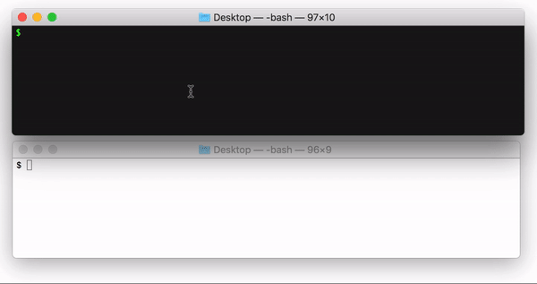
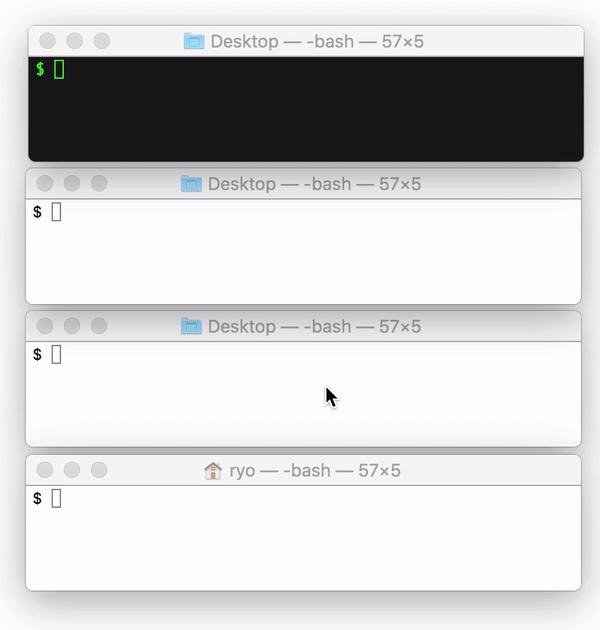

# Piping Server
[](https://www.npmjs.com/package/piping-server) [](https://www.codefactor.io/repository/github/nwtgck/piping-server) [](https://circleci.com/gh/nwtgck/piping-server) [](https://ci.appveyor.com/project/nwtgck/piping-server)  [](https://github.com/nwtgck/piping-server/actions) [](https://hub.docker.com/r/nwtgck/piping-server/)
 [](https://microbadger.com/images/nwtgck/piping-server "Get your own image badge on microbadger.com") [](https://dependabot.com)

[](https://heroku.com/deploy)

Streaming Data Transfer Server over HTTP/HTTPS



## How to transfer data?

Suppose a Piping Server is running on <https://piping.ml>. You can send "hello.txt" to a receiver.

```bash
# Send
cat hello.txt | curl -T - https://piping.ml/mysecret
```

```bash
# Get
curl https://piping.ml/mysecret > myhello.txt
```

## Multiple Transfer

Piping Server supports multiple receiver. The following moving image is an example. Use query parameter "?n=3" to allow 3 receivers for example.



## Web UI

Piping UI: <https://piping-ui.org>  
GitHub repository: <https://github.com/nwtgck/piping-ui-web>

## Design Philosophy

Piping Server is designed to realize the following ideas. 

1. No account
1. No installation
1. Never store data
1. Engineer friendly

Usually, when you want to send data to someone, you need to have an account in the common service among you and his/her.
In addition, the service may require you to install specific software to share the data.


Piping Server is designed to solve the problems above.
Piping Server allows you to use without any account and frees you from additional software installation because the server is available with Web browsers, `curl` and `wget` commands, which are widely pre-installed in Unix-like OS.
Because of HTTP/HTTPS, users can send data across different devices such as Windows, macOS, Unix, Linux, iOS, Android and any device which uses HTTP. 
Furthermore, pipe in Unix-like OS allows you to send data in a more efficient and secure way.

## Engineer Friendly Help

You can get help and version only with `curl`!

```bash
curl piping.ml/help
```

```bash
curl piping.ml/version
```

## Run server

### Heroku deployment

Click the button below to deploy a Piping Server to Heroku.

[](https://heroku.com/deploy)


### Run server on localhost

```bash
# Install
npm install -g piping-server
# Run a server
piping-server
```
Then, a Piping Server is running on <http://localhost:8080>.

### Command-line Options

Here is available command-line options by `piping-server --help`.

```
Options:
  --help          Show help                                            [boolean]
  --version       Show version number                                  [boolean]
  --http-port     Port of HTTP server                            [default: 8080]
  --enable-https  Enable HTTPS                                  [default: false]
  --https-port    Port of HTTPS server                                  [number]
  --key-path      Private key path                                      [string]
  --crt-path      Certification path                                    [string]
```

### Run on Docker

Run a Piping Server on <http://localhost:8181> by the following command.

```bash
docker run -p 8181:8080 nwtgck/piping-server
```

You can also specify an option like the following.

```bash
docker run -p 8181:80 nwtgck/piping-server --http-port=80
```

You can run a server in background and it automatically always restarts.

```bash
docker run -p 8181:80 -d --restart=always nwtgck/piping-server --http-port=80
```

## More about Piping Server

[Ecosystem around Piping Server · nwtgck/piping-server Wiki](https://github.com/nwtgck/piping-server/wiki/Ecosystem-around-Piping-Server)  
This contains end-to-end encrypted chat/file transfer/screen sharing/voice chat/drawing share and some English and Japanese posts.

Piping Server is simple and streams any kind of data, not limited to a file.
